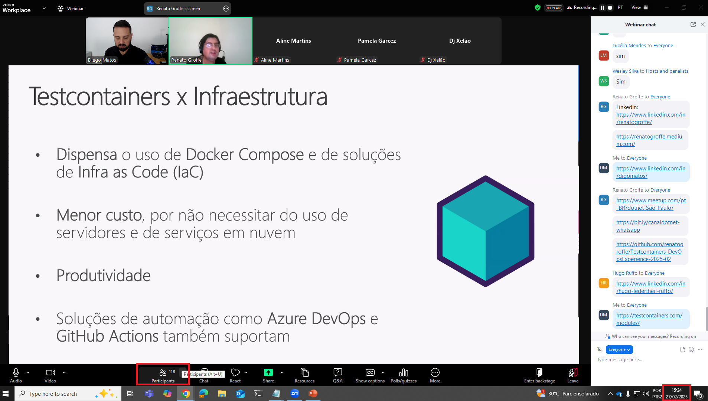
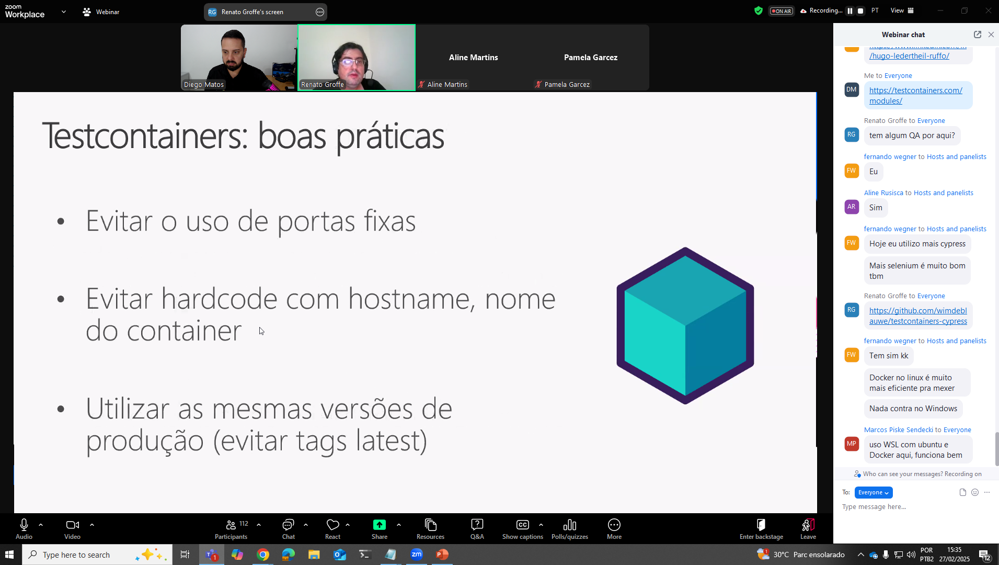
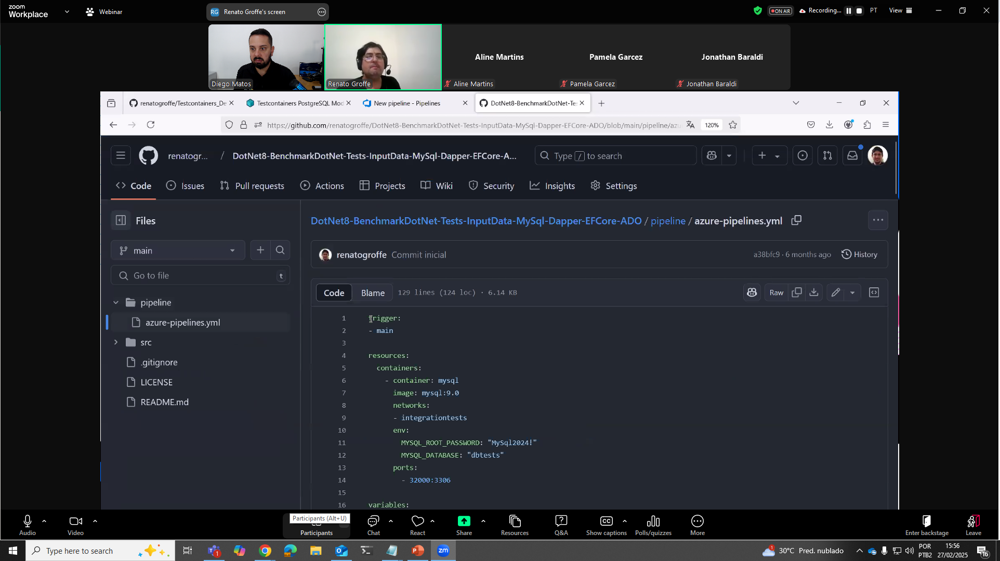
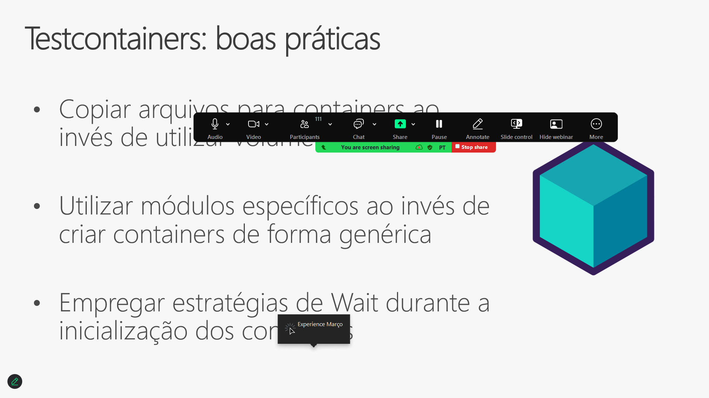
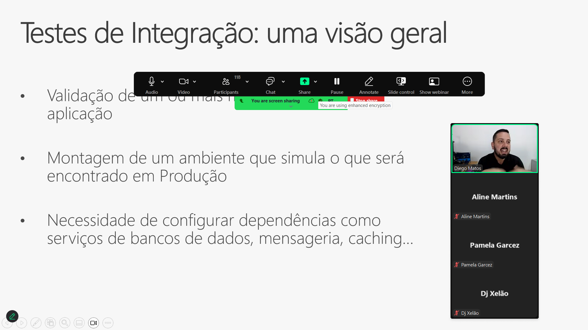
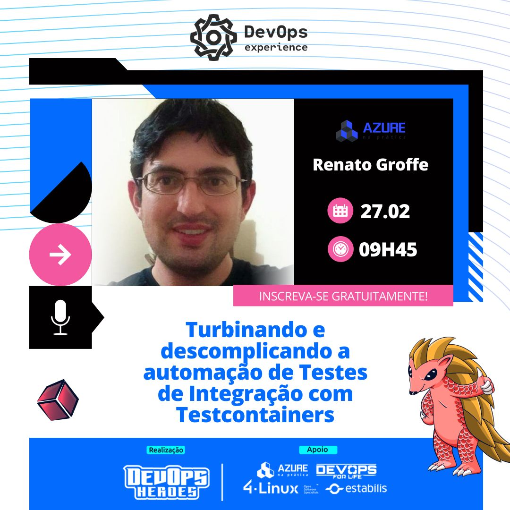
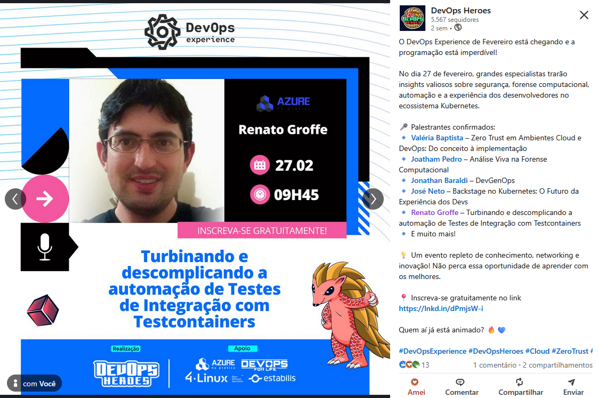

# Testcontainers_DevOpsExperience-2025-02
Conteúdos sobre Testcontainers de apresentação realizada durante a edição de Fevereiro-2025 do DevOps Experience. 

Título da apresentação: **Turbinando e descomplicando a automação de Testes de Integração com Testcontainers!**

Data: **27/02/2025 (quinta-feira)**

Tipo do evento: **Online**

Ferramenta de transmissão: **Zoom**

Tecnologias e tópicos abordados: **Containers, Docker, Testcontainers, .NET 9, SQL Server, PostgreSQL, DevOps, Testes de Integração, Docker Compose, Linux, Azure DevOps, Azure Pipelines, GitHub Actions, Python, Java, Node.js...**

Número de participantes: **118 pessoas (pico de audiência ao longo da live)**

Link do evento: [**LinkedIn**](https://www.linkedin.com/posts/devopsheroes_devopsexperience-devopsheroes-cloud-activity-7299839683763576834-K5tF/)

Esta palestra foi realizada em conjunto com meu amigo **Diego Moreira Matos (Microsoft MVP)**.

Deixo aqui meus agradecimentos ao **Daniel Ginês** e à **Aline Martins** por todo o apoio para que eu partipasse como palestrante de mais uma edição do **DevOps Experience**.

---

Outros prints podem ser encontrados neste [**diretório**](/img/).